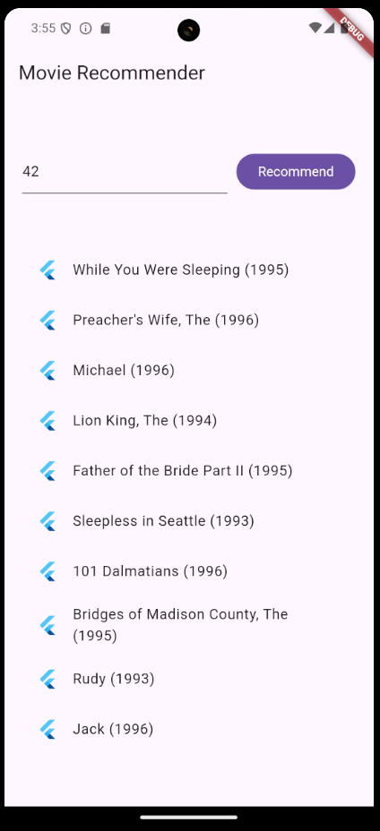

# movie_recommendation

A full-stack, multiplatform, User ID-based movie recommendation system, powered by MovieLens retrieval and ranking models, and deployed via TensorFlow Serving in a Docker container. Backend technology utilizes Python's Flask package, while the multiplatform frontend is powered by the Google's Flutter Dart framework. This follows a [Google Codelab tutorial](https://codelabs.developers.google.com/tfrecommenders-flutter?hl=en#0).




### Building
Ensure you have the prerequisite packages:
```sh
cd ./frontend
flutter pub get

cd ../backend
pip install Flask flask-cors requests numpy
# or python -m pip install Flask flask-cors requests numpy
```

To run the Docker container on mapped ports `5000:5000, 5001:5001`, run the following command (if on Windows, be sure to run the **Docker Engine first!**):
```sh
docker run -t --rm -p 8501:8501 -p 8500:8500 -v "$(pwd)/:/models/" tensorflow/serving --model_config_file=/models/models.config
```
Where `$(pwd)` is your current, to-be-expanded, working directory. For the development purposes on non-UNIX/non-LINUX (*Windows*) systems, you may replace this with your *absolute* path.

To run the Flask development server, execute the following command:
```sh
# Windows (via CMD/PS)
cd ./backend
flask --app recommender.py run

# Linux
export FLASK_APP=recommender.py
export FLASK_ENV=development
flask run
```

### Running
To run the Flutter app, you could use any of the existing running configurations (*in VS Code or IntelliJ files*), or, via CLI:
```sh
cd ./frontend
flutter run --disable-analytics --verbose
```
